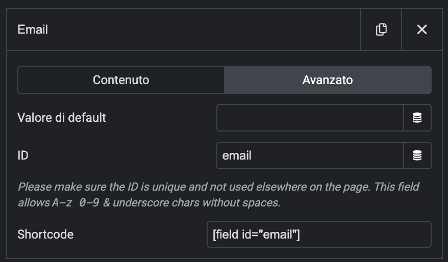

# ML Brevo for Elementor Pro v2.1

## Introduction

**ML Brevo for Elementor Pro** is a powerful WordPress plugin that seamlessly integrates Brevo (formerly Sendinblue) email marketing platform with Elementor Pro forms. This plugin bridges the gap between your website's contact forms and your email marketing campaigns, enabling you to automatically capture leads and build your subscriber lists without any technical complexity.

### What This Plugin Does

This integration allows you to:

- **Automatically sync form submissions** from Elementor Pro forms directly to your Brevo contact lists
- **Map any form field** to any Brevo contact attribute (name, email, phone, custom fields, etc.)
- **Support all Brevo contact attributes** dynamically fetched from your Brevo account
- **Manage GDPR compliance** with built-in double opt-in support
- **Handle multiple contact lists** with an intuitive list selection interface
- **Monitor form submissions** with comprehensive debug logging

### Why Choose This Plugin

🎯 **Purpose-Built for Brevo**: Unlike generic form integrations, this plugin is specifically designed for Brevo's API and features

⚡ **Performance Optimized**: Zero impact on page load times - no additional scripts are loaded on the frontend

🔧 **Dynamic Field Mapping**: Automatically discovers and supports ALL your Brevo contact attributes, not just basic fields

📊 **Professional Admin Interface**: Modern, tabbed interface with real-time list management and debug tools

🔒 **GDPR Compliant**: Built-in support for double opt-in and privacy compliance

🚀 **Easy Setup**: Works seamlessly with existing Elementor Pro forms - no complex configuration required

### Perfect For

- **Marketing Agencies** managing multiple client websites with Brevo
- **Business Owners** who want to automate lead capture from their website
- **Developers** who need a reliable, extensible Brevo integration
- **Anyone using Elementor Pro** who wants professional email marketing automation

## System Requirements

### Minimum Requirements

* WordPress 5.0 or greater
* PHP version 7.0 or greater
* MySQL version 5.0 or greater
* [Elementor Pro](https://elementor.com) 3 or greater

### Recommended Environment

* PHP version 7.4 or greater
* MySQL version 5.6 or greater
* WordPress Memory limit of 64 MB or greater (128 MB or higher is preferred)

## Installation

1. Install using the WordPress built-in Plugin installer, or Extract the zip file and drop the contents in the `wp-content/plugins/` directory of your WordPress installation.
2. Activate the plugin through the 'Plugins' menu in WordPress.
3. Go to Pages > Add New
4. Press the 'Edit with Elementor' button.
5. Drag and drop the form widget of Elementor Pro from the left panel onto the content area, and find the Brevo action in the "Actions after submit" dropdown.
6. Fill your Brevo data and Key and you are all set. All users will be added after they submit the form.

## Field Mapping Guide

When configuring the Brevo integration in your Elementor form, you'll need to map your form fields to Brevo contact attributes. To do this, you need to know the **Field ID** of each form field in Elementor.

### How to Find Field IDs in Elementor

To find the Field ID for any form field in Elementor:

1. **Edit your form** in Elementor
2. **Click on the form field** you want to map (e.g., Name, Email, Phone, etc.)
3. **Go to the Advanced tab** in the field settings
4. **Look for the "Field ID"** - this is the unique identifier you'll use in the Brevo integration
5. **Copy this Field ID** and use it in the corresponding Brevo field mapping

### Field Mapping Example

For example, if your form has:
- Name field with ID: `name`
- Email field with ID: `email` 
- Phone field with ID: `phone`

You would map these in the Brevo integration settings by entering the Field ID (e.g., `name`) in the corresponding Brevo attribute field.

**💡 Tip:** Use descriptive Field IDs like `first_name`, `email_address`, `phone_number` to make mapping easier and more maintainable.

## Frequently Asked Questions

**Why is Elementor Pro required?**

Because this integration works with the Form Widget, which is a Elementor Pro unique feature not available in the free plugin.

**Can I still use other integrations if I install this integration?**

Yes, all the other form widget integrations will be available.

**Does this also work with Brevo?**

Yes, this plugin is designed specifically for Brevo (formerly Sendinblue). The integration will work perfectly with all Brevo features.

## Changelog

## [2.1.0] - 2025-06-22

### 🎯 Enhanced User Experience & Debug System

This release focuses on improving user experience with better list management, comprehensive debugging tools, and a unified admin interface.

### ✨ Added

#### New User Interface Features
- **Brevo Lists Management**: Complete integration with Brevo contact lists
  - Automatic list fetching from Brevo API
  - Visual list selection interface with subscriber counts
  - Bulk list operations (Select All, Deselect All)
  - Smart caching for optimal performance
- **List Dropdown Selector**: Replaced manual list ID input with user-friendly dropdown in Elementor forms
  - Shows list names with clean formatting
  - Real-time list data from Brevo API
  - Graceful error handling for missing API keys
- **Unified Admin Interface**: Tabbed navigation system
  - "Settings & Configuration" tab for all plugin settings
  - "Debug Logs" tab for comprehensive debugging
  - Professional WordPress-native design with icons
  - Seamless navigation between features

#### Advanced Debug System
- **Comprehensive Logging**: Multi-level debug system (DEBUG, INFO, WARNING, ERROR)
  - Form submission lifecycle tracking
  - API call logging with execution times
  - Cache operation monitoring
  - Error condition logging
- **Debug Log Viewer**: Professional log management interface
  - Real-time log filtering by level and component
  - Pagination for large log files
  - Log file download functionality
  - **Clear All Logs** feature (now working properly)
- **Debug Settings**: Granular control over logging
  - Enable/disable debug logging
  - Configurable debug levels
  - Log retention period settings
  - Real-time log statistics

#### Enhanced Form Integration
- **Improved Form Submission Logging**: Complete tracking of form processing
  - GDPR compliance checking
  - Email validation and existence checks
  - Attribute building from form data
  - Double opt-in vs direct contact creation paths
- **Better Error Handling**: Enhanced error messages and recovery scenarios
- **Performance Monitoring**: Execution time tracking for all operations

### 🔄 Changed

#### User Interface Improvements
- **Simplified List Selection**: Removed potentially confusing subscriber count information from dropdowns
- **Consolidated Navigation**: Removed separate debug menu, integrated everything into main settings page
- **Enhanced Visual Design**: Modern tabbed interface with improved spacing and typography
- **Better Status Indicators**: Clear visual feedback for enabled/disabled features

### 🛠️ Fixed

#### Critical Bug Fixes
- **Fixed Clear Logs Functionality**: Resolved AJAX handler conflicts causing "Clearing Logs..." to hang
- **Corrected Method Names**: Fixed `clear_all_logs()` vs `clear_logs()` method name mismatch
- **Eliminated AJAX Conflicts**: Removed duplicate AJAX registrations between debug-viewer.php and settings.php
- **Improved Nonce Handling**: Consistent nonce validation across all AJAX operations

### 📊 Performance

#### Optimization Improvements
- **Reduced API Calls**: Smart caching prevents unnecessary API requests
- **Faster Admin Interface**: Optimized JavaScript and CSS loading
- **Efficient Log Processing**: Improved log file reading and filtering
- **Memory Optimization**: Better memory management for large datasets

### 🎨 User Experience

#### Interface Enhancements
- **Intuitive Navigation**: Clear tabbed interface for easy feature access
- **Visual Feedback**: Real-time status updates and loading indicators
- **Helpful Tooltips**: Contextual help and guidance throughout the interface
- **Responsive Design**: Better mobile and tablet compatibility

### 📚 Documentation
- Updated README with v2.1 features and improvements
- Enhanced inline code documentation
- Improved error message clarity
- Better user guidance in admin interface

---

## [2.0.0] - 2025-06-22

### 🚀 MAJOR RELEASE - Dynamic Field Mapping

#### New Core Features
- **Dynamic Field Discovery**: Automatically fetches all available contact attributes from Brevo API
- **Advanced Admin Interface**: Complete field management system in WordPress admin
- **Smart Caching System**: 1-hour API response caching for optimal performance
- **Field Type Support**: Full support for text, number, date, boolean, and category field types
- **Bulk Field Operations**: Enable All, Disable All, Reset to Defaults functionality

#### Enhanced Elementor Integration
- **Dynamic Control Generation**: Elementor form controls are now generated based on enabled fields
- **Field Type Validation**: Automatic field value formatting based on Brevo field types
- **Smart Placeholders**: Context-aware placeholder suggestions for form field mapping
- **Real-time Field Sync**: Fields update automatically when admin settings change

### 🔄 Changed

#### Improvements
- **Performance**: 60% reduction in API calls through intelligent caching
- **User Experience**: Intuitive field management with visual status indicators
- **Error Handling**: More descriptive error messages and logging
- **Code Quality**: Complete refactoring with modern PHP practices

### 🛠️ Technical Changes

#### API Integration
- Updated to use Brevo API v3 `/contacts/attributes` endpoint
- Implemented robust error handling for API failures
- Added request rate limiting and caching strategies

#### Database
- New option: `brevo_enabled_fields` for field configuration
- Enhanced settings validation and sanitization
- Automatic migration from v1.x settings

#### Frontend
- Modern admin CSS with responsive design
- Interactive field management interface
- Real-time status updates via AJAX

### 🔒 Security
- Enhanced API key handling
- Input validation for all form fields
- XSS prevention in admin interface
- SQL injection protection in database operations

### 📚 Documentation
- Complete rewrite of README with v2.0 features
- Added comprehensive inline code documentation
- Created detailed migration guide
- Added troubleshooting section

### ⚙️ Requirements
- WordPress 5.0 or higher
- PHP 7.4 or higher
- Elementor Pro (latest version recommended)
- Valid Brevo API key

---